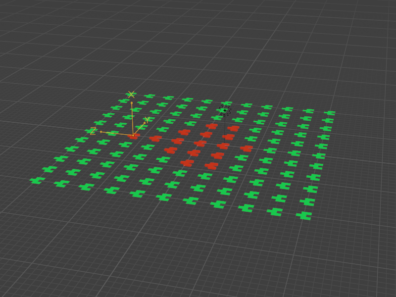
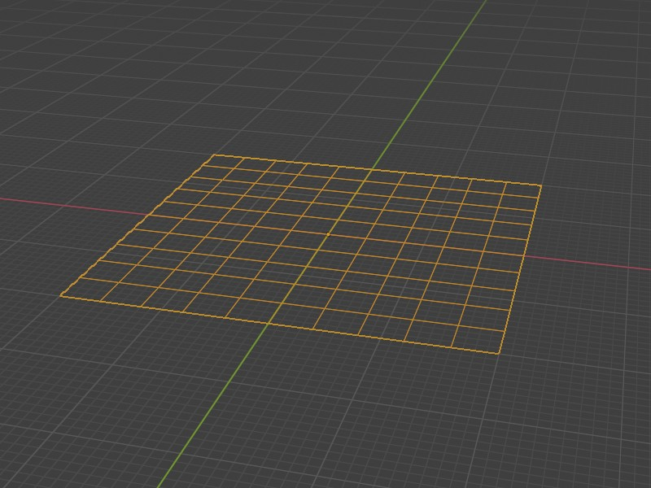
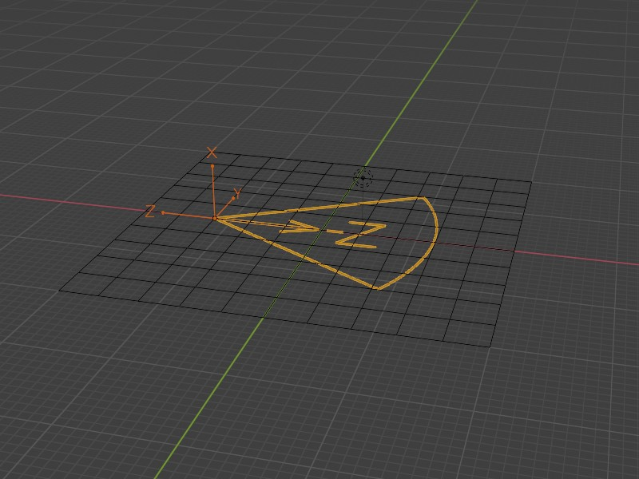
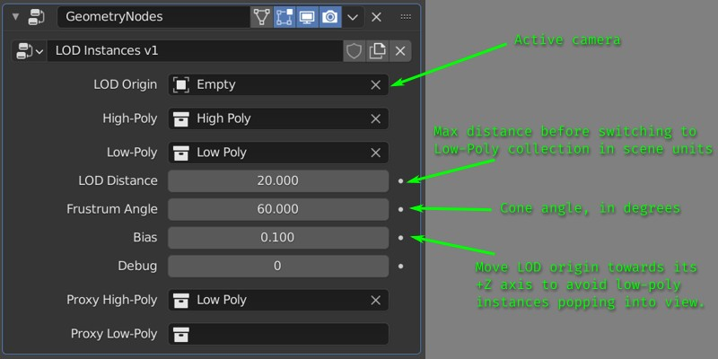

# LOD Instances

## Usage

This node setup instantiates collections on points of an instancer mesh.
Based on an `LOD Distance` and `Frustum Angle` either the High-Poly
collection is instances or the Low-Poly one.  Also you can use proxies for
both version is you set `Debug` to `1`.

## Instancer

You can use any mesh as an instances.  Either points (via `Point Distribute`)
or (if there are no points) vertices will be used to instantiate collections.

You can rotate and scale points in a separate geometry nodes modifier before
applying `LOD Instances`.  Note that you should not use a `Point Instance`
node if you are planning to use `LOD Instances`.

## Collections

You need at least one collection to instantiate on the instancer mesh.  Just
setting the High-Poly collection would result in a frustum culling effect.

If you want to use the LOD feature you need one High-Poly collection and one
Low-Poly collection.

Additionally you can set up proxy collections or (for example) re-use Low-Poly
collection as `Proxy High-Poly`.

## Geometry Nodes

You need an object to define the location and direction of the viewing
frustum.  This can be any kind of object, but ideally you want to use your
active camera.  Note that frustum is located around -Z axis of this object, as
a cone.

You can see the available options below:

If you enable `Debug` (set it to `1`) proxy versions of collections will be
displayed in the viewport, or nothing if the relevant collection is not set.
But when you render collections set as `High-Poly` and `Low-Poly` will be
used.  Note that rendered view and material preview are not considered as
renders in this context, only actual renders.  So don't be surprised to see
proxy collections when you switch to material preview or rendered viewport
mode.

## License

Copyright © 2021  Atamert Ölçgen

Distributed under the GNUv3 License
